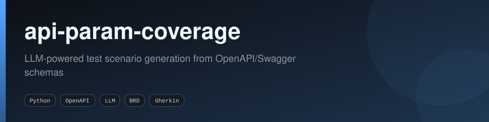
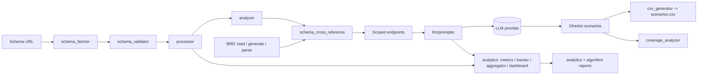

<div align="center">



[](https://github.com/fabricioguidine/api-param-coverage/actions/workflows/ci.yml)
[](https://codecov.io/gh/fabricioguidine/api-param-coverage)
[](LICENSE)
[](https://www.python.org/)
[](https://github.com/astral-sh/ruff)
[](https://mypy-lang.org/)
[](https://pre-commit.com/)
[](#)

</div>

> Generate Gherkin test scenarios from OpenAPI/Swagger schemas using LLM-powered analysis and Business Requirement Document (BRD) integration.

api-param-coverage downloads and validates an OpenAPI/Swagger schema, extracts every parameter and constraint, optionally cross-references the schema against a Business Requirement Document to scope testing, and uses an LLM to generate Gherkin test scenarios. Each run emits structured analytics, algorithm execution reports, and a CSV of the generated scenarios.

## Table of Contents

- [Features](#features)
- [Architecture](#architecture)
- [Installation](#installation)
- [Quick Start](#quick-start)
- [Usage](#usage)
- [BRD System](#brd-system)
- [Analytics and Reporting](#analytics-and-reporting)
- [Configuration](#configuration)
- [Testing](#testing)
- [Output Format](#output-format)
- [Project structure](#project-structure)
- [Troubleshooting](#troubleshooting)
- [License](#license)

## Features

### Schema handling

- Multi-format support for Swagger 2.0, OpenAPI 3.0, and OpenAPI 3.1 (JSON and YAML).
- Automatic schema download from a URL with format detection and validation.
- Deep analysis that extracts parameters, constraints, `$ref` resolution, iteration domains, and complexity metrics.

### LLM-powered generation

- Generates Gherkin test scenarios via a configurable LLM provider.
- Provider auto-detected from the API key format: OpenAI, Anthropic, Google, or Azure OpenAI.
- Automatic chunking of large schemas, token-limit management, and retry logic.

### BRD integration

- Load existing BRD schema files, generate a BRD from a Swagger schema, or parse one from a document (PDF, Word, TXT, CSV, Markdown).
- Cross-references BRD requirements against schema endpoints to scope generation to only the endpoints that matter.
- Coverage analysis of generated scenarios against BRD requirements.

### Analytics and performance

- Per-algorithm execution reports with input/output complexity metrics.
- LLM call metrics (token usage, prompt/response sizes, model, execution time).
- Analytics aggregation and dashboard reporting across runs.
- Performance utilities for caching, parallelism, profiling, and optimization.

### Output

- CSV export of generated Gherkin features, scenarios, and steps.
- Interactive CLI with progress bars, status messages, validated selection menus, and error recovery.

## Architecture



The pipeline is orchestrated by `main.py`. Schema modules live under `src/modules/swagger`, processing and LLM logic under `src/modules/engine`, BRD logic under `src/modules/brd`, and run orchestration helpers under `src/modules/workflow`.

## Installation

### Prerequisites

- Python 3.9 or higher.
- An LLM API key (OpenAI, Anthropic, Google, or Azure OpenAI; provider auto-detected from key format).
- Internet connection for schema downloading.

### Setup

Clone the repository:

```powershell
git clone https://github.com/fabricioguidine/api-param-coverage.git
cd api-param-coverage
```

Create and activate a virtual environment:

```powershell
python -m venv venv
venv\Scripts\Activate.ps1   # Linux/macOS: source venv/bin/activate
```

Install dependencies:

```powershell
pip install -r requirements.txt
```

Configure your API key. Copy `.env.example` to `.env` and set your key:

```powershell
Copy-Item .env.example .env
```

The provider is auto-detected from the key format:

| Provider | Key prefix | Default model |
|----------|-----------|---------------|
| OpenAI | `sk-...` | `gpt-4` |
| Anthropic | `sk-ant-...` | `claude-3-sonnet` |
| Google | `AIza...` | `gemini-pro` |
| Azure OpenAI | `api-...` | `gpt-4` |

The key is read from `LLM_API_KEY` (or `OPENAI_API_KEY`). Never commit `.env`; it is already in `.gitignore`.

For BRD document parsing (PDF, Word), install the optional extras:

```powershell
pip install PyPDF2 python-docx
```

## Quick Start

```powershell
python main.py
```

The interactive workflow walks you through:

1. Entering a Swagger/OpenAPI schema URL (press Enter for the default `https://api.weather.gov/openapi.json`).
2. Downloading, validating, and processing the schema.
3. Handling a BRD: load an existing file, generate one from the schema, or parse one from a document.
4. Cross-referencing the BRD with the schema to scope endpoints.
5. Generating Gherkin scenarios for the scoped endpoints.
6. Exporting to CSV and writing analytics reports.

## Usage

### Basic workflow

1. **Schema input**: provide a Swagger/OpenAPI schema URL.
2. **Schema processing**: the tool downloads, validates, and processes the schema.
3. **BRD handling**: load an existing BRD, generate one from the schema via LLM, or parse one from a document (PDF, Word, TXT, CSV, Markdown).
4. **Scope filtering**: cross-reference the BRD with the schema to filter endpoints.
5. **Test generation**: generate Gherkin scenarios only for BRD-covered endpoints.
6. **Export**: save results to CSV.
7. **Analytics**: review the analytics and per-algorithm reports.

### Example session

```text
======================================================================
Swagger Schema Processor & Test Scenario Generator
======================================================================

Enter Swagger/OpenAPI schema URL (or press Enter to use example): https://petstore.swagger.io/v2/swagger.json

Step 1: Downloading schema...
  Detected: SWAGGER 2.0 - Swagger Petstore
Step 2: Processing schema...
  API: Swagger Petstore | Endpoints: 20
Step 3: Analyzing schema for test traceability...
Step 4: Business Requirement Document (BRD)...
  1. Load existing BRD file
  2. Generate BRD from Swagger schema (using LLM)
  Enter choice (1 or 2): 2
  BRD generated: API Test Requirements Document (Requirements: 15)
Step 5: Cross-referencing BRD with Swagger schema...
  Total: 20 | Covered: 15 | Coverage: 75.0%
Step 6: Generating Gherkin test scenarios via LLM...
Step 7: Saving to CSV...
  CSV saved: output/<timestamp>_petstore/petstore...-<timestamp>.csv

Processing complete.
```

A complete reference run is committed under `output/example_weather_api/` (CSV scenarios, generated BRD JSON, analytics, validation, and algorithm reports). See `output/example_weather_api/README.md`.

## BRD System

A Business Requirement Document (BRD) defines which API endpoints and scenarios should be tested based on business requirements. The tool uses the BRD to scope and focus test generation on the endpoints that matter.

BRD schema files are stored in `src/modules/brd/input_schema/`. See `src/modules/brd/input_schema/README.md` for the complete schema format.

Key components:

- **Requirements**: business requirements list.
- **Endpoints**: API endpoint paths and methods.
- **Test scenarios**: specific test cases per requirement.
- **Priority**: critical, high, medium, or low.
- **Acceptance criteria**: success criteria per requirement.

Workflow:

1. **Create**: generate from the schema or parse from a document.
2. **Validate**: validate the BRD against the schema.
3. **Cross-reference**: match BRD requirements with schema endpoints.
4. **Filter**: keep only BRD-covered endpoints.
5. **Generate**: create scenarios for the filtered scope.

## Analytics and Reporting

Each run writes analytics under `output/<timestamp>_<schema>/analytics/`.

| Output | Pattern | Description |
|--------|---------|-------------|
| LLM execution metrics | `YYYYMMDD_HHMMSS.txt` | General LLM call metrics |
| Algorithm reports | `reports/..._<type>_<name>.txt` | Per-algorithm analysis |

LLM metrics include execution time, prompt/completion/total token usage, prompt and response sizes, the model used, and the task type. Algorithm metrics include the algorithm name and type, input complexity (size, structure, depth), output complexity (quality, element count), execution time, and algorithm-specific metrics. Complexity analysis covers endpoint counts, parameter counts and distributions, enum/pattern/bounded constraint analysis, iteration domain counts, and coverage percentages.

Each algorithm report contains: algorithm information, input analysis, output analysis, algorithm-specific metrics, and (where applicable) an LLM analysis section.

## Configuration

Configuration is provided through environment variables, typically via a `.env` file (see `.env.example`).

| Variable | Description | Required |
|----------|-------------|----------|
| `LLM_API_KEY` / `OPENAI_API_KEY` | LLM API key (provider auto-detected) | Yes |
| `LLM_PROVIDER` | Override the detected provider | No |
| `LLM_MODEL` | LLM model to use | No |
| `LLM_MAX_TOKENS` | Maximum response tokens | No |
| `LLM_TEMPERATURE` | LLM temperature | No |
| `CHUNK_SIZE` | Endpoints per chunk | No |
| `CHUNKING_THRESHOLD` | Endpoints before chunking | No |
| `OUTPUT_DIR` | Output directory path | No |
| `SCHEMAS_DIR` | Schema storage directory | No |
| `APP_ENV` | Environment name | No |
| `DEBUG` / `VERBOSE` | Verbose/debug output | No |

Defaults: LLM model auto-detected from the key (`gpt-4` for OpenAI, `claude-3-sonnet` for Anthropic, `gemini-pro` for Google), max tokens `3000`, temperature `0.7`, output directory `output/`, BRD directory `src/modules/brd/input_schema/`. Schemas are downloaded to a temporary directory and cleaned up after processing.

Supported schema types: Swagger 2.0, OpenAPI 3.0.0, and OpenAPI 3.1.0 (JSON/YAML), including partial schemas (with warnings) and schemas with missing optional fields (normalized).

## Testing

The project uses pytest with coverage, plus Behave for BDD feature tests.

```powershell
# Run the full suite
pytest

# Verbose
pytest -v

# Coverage (HTML report)
pytest --cov=src --cov-report=html

# CLI / UI-UX unit tests
pytest tests/unit/cli/test_cli_utils.py -v

# BDD feature tests
behave tests/features/ui_ux_*.feature
```

Markers are defined in `pyproject.toml` (`unit`, `integration`, `e2e`, `performance`, `security`, `regression`, `slow`, `llm`, `network`). CI runs `pytest -m "not llm and not network and not slow and not performance"` with `--cov-fail-under=40` across Python 3.9-3.12 on Linux, Windows, and macOS.

Test coverage spans schema fetching and validation, schema processing and analysis, LLM prompting, CSV generation, BRD schema operations, BRD parsing and generation, schema cross-referencing, analytics collection, and CLI/terminal interactions. See `tests/docs/UI_UX_TESTING.md` for the UI/UX testing details.

## Output Format

### CSV

CSV files are saved under `output/<timestamp>_<filename>/` with these columns:

- `Feature`: Gherkin feature name.
- `Scenario`: scenario name.
- `Tags`: comma-separated tags.
- `Given` / `When` / `Then`: semicolon-separated steps.
- `All Steps`: all steps combined.

### Analytics reports

- LLM execution metrics (`analytics/*.txt`): execution info, API info, schema statistics, complexity analysis, prompt metrics, token usage, response metrics.
- Algorithm reports (`analytics/reports/*.txt`): algorithm info, input/output complexity, algorithm-specific metrics, and LLM call analysis where applicable.

## Project structure

```
api-param-coverage/
├── main.py                       # Orchestrates the full workflow
├── src/
│   ├── modules/
│   │   ├── swagger/              # schema_fetcher, schema_validator
│   │   ├── engine/
│   │   │   ├── algorithms/       # processor, analyzer, csv_generator
│   │   │   ├── analytics/        # metrics_collector, algorithm_tracker, aggregator, dashboard
│   │   │   ├── coverage/         # coverage_analyzer
│   │   │   ├── llm/              # prompter
│   │   │   └── performance/      # cache, optimizer, parallel, profiler
│   │   ├── brd/                  # schema, loader, parser, validator, generator, cross_reference
│   │   ├── workflow/             # brd_handler, coverage_handler, scenario_generator
│   │   ├── cli/                  # cli_utils
│   │   └── utils/                # constants, json_utils, llm_provider, output_manager
│   └── utils/                    # validators
├── tests/                        # unit, integration, e2e, performance, security, BDD features
├── docs/                         # documentation
├── output/                       # run outputs + example_weather_api reference run
├── pyproject.toml                # build, ruff, mypy, pytest, coverage, bandit config
├── requirements.txt
└── requirements-dev.txt
```

## Troubleshooting

| Issue | Solutions |
|-------|-----------|
| Empty CSV files | Verify `LLM_API_KEY` is set in `.env`; check network connectivity to the LLM API; confirm the schema has analyzable endpoints; review console output. |
| Schema validation warnings | Missing optional fields are normalized; partial schemas may warn but still work; verify the schema matches the OpenAPI/Swagger spec. |
| LLM generation failures | Check API key validity and provider credits; review token usage in analytics; use smaller schema subsets; retry (automatic retry is included). |
| BRD parsing issues | Ensure the document format is supported; install `PyPDF2` and `python-docx`; check document structure; review LLM parsing logs. |
| Token limit errors | Large schemas are chunked automatically; for very large schemas use a model with a larger context window and review chunk size settings. |

## License

[MIT](LICENSE) © 2026 fabricioguidine
