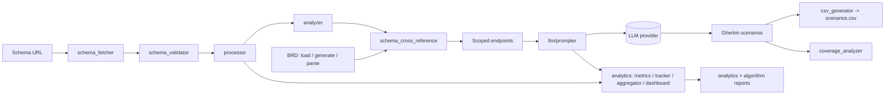

# api-param-coverage

Generate Gherkin test scenarios from OpenAPI/Swagger schemas using LLM-powered analysis and Business Requirement Document (BRD) integration. The tool downloads and validates a schema, extracts parameters and constraints, optionally scopes testing against a BRD, and emits Gherkin scenarios plus structured analytics.

[](https://github.com/fabricioguidine/api-param-coverage/actions/workflows/ci.yml) [](https://codecov.io/gh/fabricioguidine/api-param-coverage) [](LICENSE) [](https://www.python.org/)

## Features

- **Schema handling:** Swagger 2.0, OpenAPI 3.0, and OpenAPI 3.1 (JSON and YAML), with automatic download, format detection, and validation.
- **Deep analysis:** extracts parameters, constraints, `$ref` resolution, iteration domains, and complexity metrics.
- **LLM-powered generation:** Gherkin scenarios via a configurable provider, auto-detected from the API key format (OpenAI, Anthropic, Google, or Azure OpenAI), with chunking, token-limit management, and retry logic.
- **BRD integration:** load an existing BRD, generate one from a schema, or parse one from a document (PDF, Word, TXT, CSV, Markdown); cross-reference requirements against endpoints to scope generation.
- **Analytics:** per-algorithm execution reports, LLM call metrics, aggregation, and dashboard reporting across runs.
- **Output:** CSV export of generated features, scenarios, and steps, driven by an interactive CLI with progress bars, status messages, and error recovery.

## Architecture



The pipeline is orchestrated by `main.py`. Schema modules live under `src/modules/swagger`, processing and LLM logic under `src/modules/engine`, BRD logic under `src/modules/brd`, and run orchestration helpers under `src/modules/workflow`.

## Prerequisites

- Python 3.9 or higher.
- An LLM API key (OpenAI, Anthropic, Google, or Azure OpenAI; provider auto-detected from key format).
- Internet connection for schema downloading.

## Installation

```powershell
git clone https://github.com/fabricioguidine/api-param-coverage.git
cd api-param-coverage
python -m venv venv
venv\Scripts\Activate.ps1   # Linux/macOS: source venv/bin/activate
pip install -r requirements.txt
```

For BRD document parsing (PDF, Word), install the optional extras:

```powershell
pip install PyPDF2 python-docx
```

## Usage

```powershell
python main.py
```

The interactive workflow walks through:

1. Entering a Swagger/OpenAPI schema URL (press Enter for the default `https://api.weather.gov/openapi.json`).
2. Downloading, validating, and processing the schema.
3. Handling a BRD: load an existing file, generate one from the schema, or parse one from a document.
4. Cross-referencing the BRD with the schema to scope endpoints.
5. Generating Gherkin scenarios for the scoped endpoints.
6. Exporting to CSV and writing analytics reports.

A complete reference run is committed under `output/example_weather_api/` (CSV scenarios, generated BRD JSON, analytics, validation, and algorithm reports). See `output/example_weather_api/README.md`.

### BRD system

A Business Requirement Document defines which endpoints and scenarios should be tested. BRD schema files are stored in `src/modules/brd/input_schema/`; see that directory's `README.md` for the schema format. A BRD carries requirements, endpoints, test scenarios, priority (critical/high/medium/low), and acceptance criteria. The tool creates or parses a BRD, validates it against the schema, cross-references requirements with endpoints, filters to covered endpoints, and generates scenarios for that scope.

## Configuration

Configuration is provided through environment variables, typically via a `.env` file (copy `.env.example` to `.env`). The provider is auto-detected from the API key format.

| Provider | Key prefix | Default model |
|----------|-----------|---------------|
| OpenAI | `sk-...` | `gpt-4` |
| Anthropic | `sk-ant-...` | `claude-3-sonnet` |
| Google | `AIza...` | `gemini-pro` |
| Azure OpenAI | `api-...` | `gpt-4` |

| Variable | Description | Required |
|----------|-------------|----------|
| `LLM_API_KEY` / `OPENAI_API_KEY` | LLM API key (provider auto-detected) | Yes |
| `LLM_PROVIDER` | Override the detected provider | No |
| `LLM_MODEL` | LLM model to use | No |
| `LLM_MAX_TOKENS` | Maximum response tokens (default `3000`) | No |
| `LLM_TEMPERATURE` | LLM temperature (default `0.7`) | No |
| `CHUNK_SIZE` | Endpoints per chunk | No |
| `CHUNKING_THRESHOLD` | Endpoints before chunking | No |
| `OUTPUT_DIR` | Output directory path (default `output/`) | No |
| `SCHEMAS_DIR` | Schema storage directory | No |
| `APP_ENV` | Environment name | No |
| `DEBUG` / `VERBOSE` | Verbose/debug output | No |

The key is never committed; `.env` is already in `.gitignore`. Schemas are downloaded to a temporary directory and cleaned up after processing.

## Output format

CSV files are saved under `output/<timestamp>_<filename>/` with columns: `Feature`, `Scenario`, `Tags`, `Given`/`When`/`Then` (semicolon-separated steps), and `All Steps`.

Analytics are written under `output/<timestamp>_<schema>/analytics/`:

- LLM execution metrics (`analytics/*.txt`): execution info, API info, schema statistics, complexity analysis, prompt metrics, token usage, response metrics.
- Algorithm reports (`analytics/reports/*.txt`): algorithm info, input/output complexity, algorithm-specific metrics, and LLM call analysis where applicable.

## Project structure

```
api-param-coverage/
├── main.py                       # Orchestrates the full workflow
├── src/
│   ├── modules/
│   │   ├── swagger/              # schema_fetcher, schema_validator
│   │   ├── engine/
│   │   │   ├── algorithms/       # processor, analyzer, csv_generator
│   │   │   ├── analytics/        # metrics_collector, algorithm_tracker, aggregator, dashboard
│   │   │   ├── coverage/         # coverage_analyzer
│   │   │   ├── llm/              # prompter
│   │   │   └── performance/      # cache, optimizer, parallel, profiler
│   │   ├── brd/                  # schema, loader, parser, validator, generator, cross_reference
│   │   ├── workflow/             # brd_handler, coverage_handler, scenario_generator
│   │   ├── cli/                  # cli_utils
│   │   └── utils/                # constants, json_utils, llm_provider, output_manager
│   └── utils/                    # validators
├── tests/                        # unit, integration, e2e, performance, security, BDD features
├── docs/                         # documentation
├── output/                       # run outputs + example_weather_api reference run
├── pyproject.toml                # build, ruff, mypy, pytest, coverage, bandit config
├── requirements.txt
└── requirements-dev.txt
```

## Testing

The project uses pytest with coverage, plus Behave for BDD feature tests.

```powershell
# Run the full suite
pytest

# Coverage (HTML report)
pytest --cov=src --cov-report=html

# CLI / UI-UX unit tests
pytest tests/unit/cli/test_cli_utils.py -v

# BDD feature tests
behave tests/features/ui_ux_*.feature
```

Markers are defined in `pyproject.toml` (`unit`, `integration`, `e2e`, `performance`, `security`, `regression`, `slow`, `llm`, `network`). CI runs `pytest -m "not llm and not network and not slow and not performance"` with `--cov-fail-under=40` across Python 3.9-3.12 on Linux, Windows, and macOS. See `tests/docs/UI_UX_TESTING.md` for UI/UX testing details.

## License

[MIT](LICENSE)
