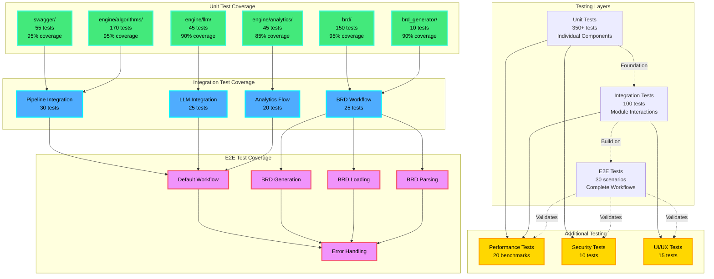

# Test Architecture Diagram

## Testing Layers Overview

### 1. Unit Tests (Base Layer) - 350+ tests
- **swagger/**: Schema fetching and validation (55 tests)
- **engine/algorithms/**: Core processing logic (170 tests)
- **engine/llm/**: LLM integration (45 tests)
- **brd/**: BRD operations (150 tests)
- **brd_generator/**: BRD generation (10 tests)
- **engine/analytics/**: Metrics and reporting (45 tests)

### 2. Integration Tests (Middle Layer) - 100 tests
- **Pipeline Integration**: End-to-end data flow (30 tests)
- **BRD Workflow**: BRD generation, loading, parsing (25 tests)
- **LLM Integration**: Schema to scenarios pipeline (25 tests)
- **Analytics Flow**: Metrics collection and reporting (20 tests)

### 3. E2E Tests (Top Layer) - 30 scenarios
- **Default Workflow**: Process schema without BRD
- **BRD Generation**: Generate BRD from Swagger
- **BRD Loading**: Use existing BRD file
- **BRD Parsing**: Parse BRD from documents
- **Error Handling**: Graceful failure scenarios

### 4. Additional Testing - 45 tests
- **Performance Tests**: Processing speed, memory, load (20 benchmarks)
- **Security Tests**: Input validation, data protection (10 tests)
- **UI/UX Tests**: CLI interactions, user experience (15 tests)

## Test Flow Dependencies

```
Unit Tests (Foundation)
    ↓
Integration Tests (Build on unit tests)
    ↓
E2E Tests (Validate complete workflows)
    ↓
Performance, Security, UI/UX (Validate quality attributes)
```

## Coverage Goals Summary

| Layer | Tests | Target Coverage | Priority |
|-------|-------|----------------|----------|
| **Unit Tests** | 350+ | 95% | Critical |
| **Integration** | 100 | 90% | High |
| **E2E** | 30 | 100% (critical paths) | Critical |
| **Performance** | 20 | N/A (benchmarks) | High |
| **Security** | 10 | 100% | Critical |
| **UI/UX** | 15 | 80% | Medium |
| **TOTAL** | **525+** | **95%+** | - |

## Test Execution Strategy

### Phase 1: Foundation (Weeks 1-2) - 70% coverage
- Set up test infrastructure
- Implement unit tests for core modules
- Create test fixtures and mocks
- **Focus**: swagger/, engine/algorithms/, brd/

### Phase 2: Integration (Weeks 3-4) - 85% coverage
- Implement integration tests
- Create BDD scenarios (Behave)
- Add LLM integration tests with mocks
- **Focus**: Pipeline, BRD workflow, LLM integration

### Phase 3: Advanced (Weeks 5-6) - 95% coverage
- Implement E2E workflows
- Add performance and load tests
- Implement security tests
- **Focus**: Complete workflows, benchmarks, security

### Phase 4: Refinement (Weeks 7-8) - 95%+ coverage
- Add edge case tests
- Implement regression suite
- Performance optimization
- **Focus**: Quality, edge cases, optimization

## Testing Tools

| Tool | Purpose | Layer |
|------|---------|-------|
| **pytest** | Unit & integration testing | All |
| **pytest-cov** | Code coverage measurement | All |
| **behave** | BDD/E2E testing | E2E |
| **pytest-mock** | Mocking dependencies | Unit, Integration |
| **pytest-benchmark** | Performance testing | Performance |
| **responses** | HTTP request mocking | Unit, Integration |

## Quality Gates

✅ **All tests pass** (100% pass rate)
✅ **Code coverage ≥ 95%** (overall)
✅ **No critical bugs** (severity: high/critical)
✅ **Performance benchmarks met** (processing times within limits)
✅ **Security scan passed** (no vulnerabilities)
✅ **Documentation updated** (test documentation current)

## Continuous Integration

```yaml
CI Pipeline:
1. Run unit tests (fast)
2. Run integration tests
3. Run E2E tests
4. Generate coverage report
5. Run security scan
6. Deploy if all pass
```

## Key Metrics to Track

- **Total Tests**: 525+
- **Code Coverage**: 95%+
- **Test Pass Rate**: 100%
- **Average Test Duration**: <5 minutes
- **Flaky Tests**: 0
- **Critical Path Coverage**: 100%
